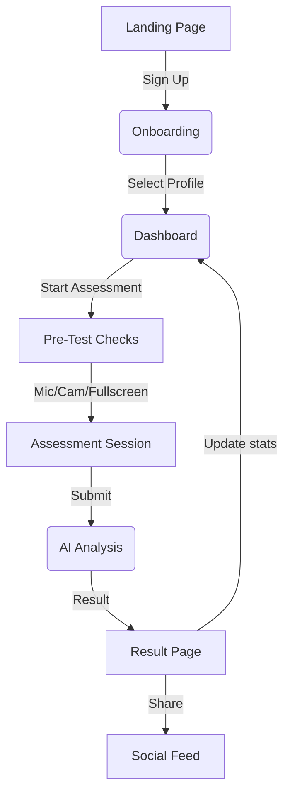
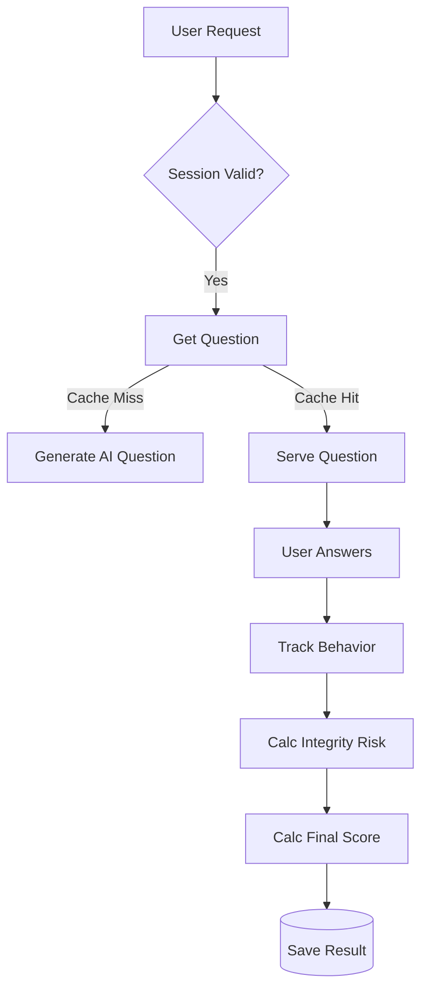
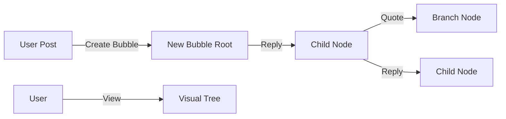
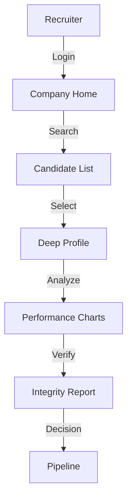

# 🔄 THE SENSES — WORKFLOWS

## 1. User Application Flow

```mermaid
graph TD
    A[Landing Page] -->|Sign Up| B(Onboarding)
    B -->|Select Profile| C(Dashboard)
    C -->|Start Assessment| D[Pre-Test Checks]
    D -->|Mic/Cam/Fullscreen| E[Assessment Session]
    E -->|Submit| F(AI Analysis)
    F -->|Result| G[Result Page]
    G -->|Update stats| C
    G -->|Share| H[Social Feed]
```

## 2. Assessment Logic Flow

```mermaid
graph TD
    Start[User Request] --> Check{Session Valid?}
    Check -- Yes --> FetchQ[Get Question]
    FetchQ -->|Cache Miss| GenAI[Generate AI Question]
    FetchQ -->|Cache Hit| Serve[Serve Question]
    Serve --> Interaction[User Answers]
    Interaction --> Telemetry[Track Behavior]
    Telemetry --> AntiCheat[Calc Integrity Risk]
    AntiCheat --> Score[Calc Final Score]
    Score --> DB[(Save Result)]
```

## 3. Social Bubble Flow

```mermaid
graph LR
    Post[User Post] -->|Create Bubble| Bubble[New Bubble Root]
    Bubble -->|Reply| Node1[Child Node]
    Node1 -->|Quote| Node2[Branch Node]
    Node1 -->|Reply| Node3[Child Node]
    User -->|View| TreeView[Visual Tree]
```

## 4. Company Evaluation Flow

```mermaid
graph TD
    Recruiter -->|Login| Dashboard[Company Home]
    Dashboard -->|Search| Filter[Candidate List]
    Filter -->|Select| Profile[Deep Profile]
    Profile -->|Analyze| Charts[Performance Charts]
    Charts -->|Verify| Integrity[Integrity Report]
    Integrity -->|Decision| Shortlist[Pipeline]
```
